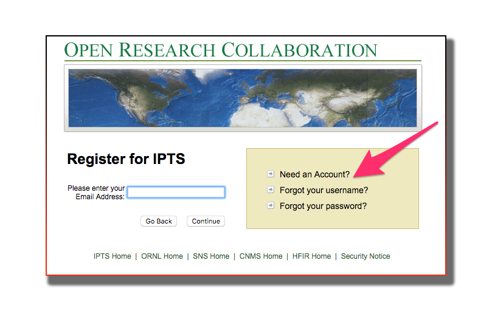

********
Analysis
********

.. _how-to-access-data:

How to access your data
=======================

**Step 1** Create an XCAMS account

If you have not done so, please create an `XCAMS account <https://xcams.ornl.gov/xcams/groups/prpsl_user/index.shtml>`_

.. _how-to-connect-to-our-computer:

**Step 2** Request access to HFIR data

Request access by vising this page `https://neutronsr.us/accounts/request.html <https://neutronsr.us/accounts/request.html>`_

.. image:: _static/hfir_access.png

How to connect to our computer
==============================

the best way to analyze your data is by using our data analysis and visualization tools on our analysis computer.
No software to install, all you need is connect to our computer.

.. _how-to-start-analysis:

How to reach your data
======================

If you decide to copy/paste your data to your local computer, we recommend the use of
`FileZilla <https://sourceforge.net/projects/filezilla/>`_.

 - Install FileZilla
 - Create and configure a new bookmark

.. image:: _static/filezilla_bookmark.png

.. image:: _static/filezilla_configure.png

You can now browse to your data by following the structure  **/HFIR/CG1D/IPTS-XXXX**

.. image:: _static/filezilla_browse.png

